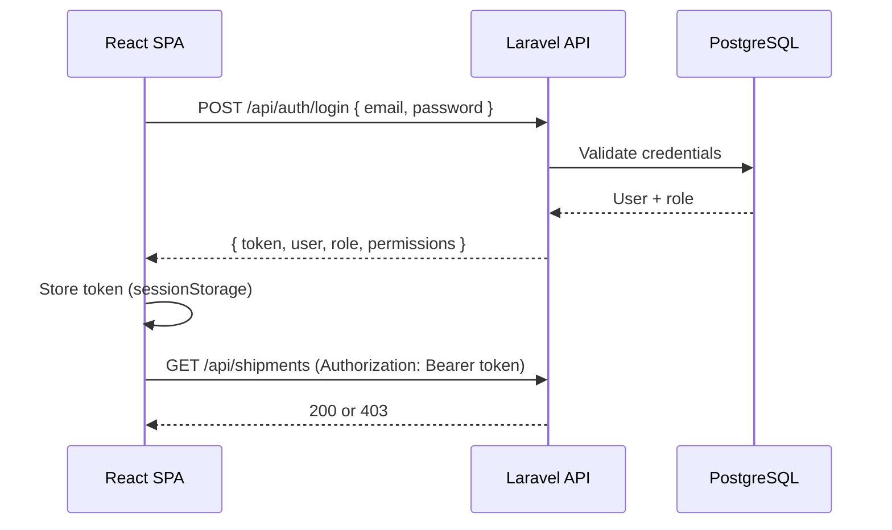

# Authentication & Role-Based Access Scope

**Task:** AUTH-ROLES-SCOPE-001  
**Status:** Scope definition — **backend auth implemented** in AUTH-BACKEND-001 (Sanctum login/logout/me, demo users, partial route protection).
**Branch context:** `feature/telegram-bot-mvp`  
**Last updated:** 2026-05-24

## Purpose

Define how Logistics MVP+ will move from an **open internal demo** (no login) to **authenticated API access** with **role-based permissions** before any auth code is written.

This document is the source of truth for the first auth implementation pass.

---

## 1. Auth approach

### Recommended stack: Laravel Sanctum (token-based)

| Decision | Choice | Rationale |
|----------|--------|-----------|
| Auth mechanism | **Laravel Sanctum** personal access tokens | Laravel-native, minimal setup, works well with React SPA + JSON API |
| Token transport | `Authorization: Bearer {token}` | Standard for API clients; easy to store in frontend session storage |
| Session/cookies | Not primary for MVP API | Avoid cross-origin cookie complexity between Vercel frontend and Render backend |
| JWT package | **Do not use** for MVP | Extra complexity; Sanctum is sufficient for internal B2B MVP |
| Password hashing | Laravel `Hash` (bcrypt) | Default users table already has `password` column |
| Login endpoint | `POST /api/auth/login` | Returns token + user profile + role |
| Logout endpoint | `POST /api/auth/logout` | Revokes current token |
| Current user | `GET /api/auth/me` | Returns user, role, permissions summary |
| Health | `GET /api/health` | **Public** — no auth required |

### Login flow (target)



### Token lifecycle (MVP)

- One active token per device/session is acceptable for MVP.
- Token stored client-side in `sessionStorage` (cleared on tab close) or `localStorage` (persistent) — **decision at implementation**; default recommendation: `sessionStorage` for demo safety.
- No refresh-token rotation in MVP.
- Admin can disable user (`is_active = false`) → all tokens invalid on next request.

### Public vs protected routes

| Route group | Auth |
|-------------|------|
| `/api/health` | Public |
| `/api/auth/login` | Public |
| All other `/api/*` | **Authenticated** (after auth rollout) |

During migration, use a feature flag or env `AUTH_REQUIRED=false` for local demo only. **Production must require auth** once rollout is complete.

---

## 2. User model fields

Extend the existing Laravel `users` table (see `backend/database/migrations/0001_01_01_000000_create_users_table.php`).

### Proposed schema additions

| Column | Type | Required | Notes |
|--------|------|----------|-------|
| `id` | bigint | yes | Existing PK |
| `name` | string | yes | Display name |
| `email` | string | yes | Unique login |
| `password` | string | yes | Hashed; never returned in API |
| `role` | string(32) | yes | Enum: `admin`, `manager`, `operator`, `finance`, `viewer` |
| `account_id` | FK → `accounts.id` | nullable | Tenant/account scope; demo seed assigns one account per demo user |
| `is_active` | boolean | yes | Default `true`; inactive users cannot log in |
| `telegram_username` | string | nullable | Optional display/link; not used for auth |
| `last_login_at` | timestamp | nullable | Audit helper |
| `email_verified_at` | timestamp | nullable | Existing; **post-MVP** verification flow |
| `remember_token` | string | nullable | Existing; unused if token-only |
| `timestamps` | | yes | Existing |

### API user resource (safe fields only)

Never expose: `password`, `remember_token`, internal tokens.

```json
{
  "id": "1",
  "name": "Админ",
  "email": "admin@logistix.kz",
  "role": "admin",
  "accountId": "1",
  "isActive": true,
  "telegramUsername": null,
  "lastLoginAt": "2026-05-24T10:00:00Z"
}
```

### Seeded demo users (implementation task)

| Email | Role | Demo account |
|-------|------|--------------|
| `admin@example.com` | admin | Admin Demo Account |
| `manager@example.com` | manager | Manager Demo Account |
| `operator@example.com` | operator | Operator Demo Account |
| `finance@example.com` | finance | Finance Demo Account |
| `viewer@example.com` | viewer | Viewer Demo Account |

Each seeded user has a distinct `account_id` and per-account `telegram_notification_settings` row for Telegram isolation QA. Password: `password` (local seed only; see `UserSeeder::DEMO_PASSWORD`).

---

## 3. Role model / enum

### PHP enum (recommended)

```php
enum UserRole: string
{
    case Admin = 'admin';
    case Manager = 'manager';
    case Operator = 'operator';
    case Finance = 'finance';
    case Viewer = 'viewer';
}
```

Stored in `users.role` as string. Validated on create/update via Form Request.

### Role hierarchy (informational only)

MVP uses **flat roles**, not inheritance. Permissions are explicit per role in the matrix below — do not infer permissions from hierarchy.

| Role | Summary |
|------|---------|
| **admin** | Full internal access |
| **manager** | Day-to-day logistics operations; limited admin |
| **operator** | Execution: tracking, status, checkpoints |
| **finance** | Billing and reports |
| **viewer** | Read-only operational visibility |

### Account model (existing)

Table `accounts` already exists (`id`, `name`, `slug`, `is_active`). MVP auth ties users to one account. Multi-tenant row scoping (shipments per account) is **post-MVP** unless explicitly added in auth phase 2.

---

## 4. Permission matrix

Legend: **R** = read/list/show, **C** = create, **U** = update, **D** = delete/archive, **—** = no access, **Own** = scoped to assigned data (phase 2).

### Module permissions

| Module / Action | admin | manager | operator | finance | viewer |
|-----------------|-------|---------|----------|---------|--------|
| **Dashboard** | R | R | R | R | R |
| **Shipments — list/show** | R | R | R | R | R |
| **Shipments — create** | C | C | — | — | — |
| **Shipments — edit fields** | U | U | — | — | — |
| **Shipments — status update** | U | U | U | — | — |
| **Shipments — archive/delete** | D | — | — | — | — |
| **Tracking — list** | R | R | R | R | R |
| **Checkpoints — create** | C | C | C | — | — |
| **Checkpoints — update** | U | U | U | — | — |
| **Checkpoints — delete** | D | — | — | — | — |
| **Managers — list** | R | R | R | — | — |
| **Managers — CRUD** | CRUD | — | — | — | — |
| **Partners/clients — list** | R | R | R | R | R |
| **Partners/clients — create/edit** | CU | CU | CU | — | — |
| **Partners/clients — delete** | D | — | — | — | — |
| **Finance — list/report** | R | R | R | R | R |
| **Finance — status update** | U | U | — | U | — |
| **Finance — export CSV** | R | R | — | R | — |
| **Telegram — status/read** | R | R | R | R | — |
| **Telegram — settings save** | U | — | — | — | — |
| **Telegram — test message** | C | — | — | — | — |
| **Telegram — notification journal** | R | R | — | — | — |
| **Users — management** | CRUD | — | — | — | — |
| **Settings — company profile** | U | — | — | — | — |
| **Exports (shipments/finance)** | R | — | — | R | — |

### HTTP endpoint mapping (current + planned)

| Method | Path | Minimum role |
|--------|------|--------------|
| GET | `/api/health` | public |
| POST | `/api/auth/login` | public |
| POST | `/api/auth/logout` | authenticated |
| GET | `/api/auth/me` | authenticated |
| GET | `/api/dashboard` | viewer+ |
| GET | `/api/shipments` | viewer+ |
| GET | `/api/shipments/{id}` | viewer+ |
| POST | `/api/shipments` | manager+ |
| PATCH | `/api/shipments/{id}/status` | operator+ |
| DELETE | `/api/shipments/{id}` | admin |
| POST | `/api/shipments/{id}/checkpoints` | operator+ |
| PATCH | `/api/checkpoints/{id}` | operator+ |
| GET | `/api/tracking` | viewer+ |
| GET | `/api/managers` | operator+ |
| POST | `/api/managers` | admin |
| PATCH | `/api/managers/{id}` | admin |
| DELETE | `/api/managers/{id}` | admin |
| GET | `/api/clients` | viewer+ |
| POST | `/api/clients` | operator+ |
| PATCH | `/api/clients/{id}` | operator+ |
| DELETE | `/api/clients/{id}` | admin |
| GET | `/api/finance` | viewer+ |
| PATCH | `/api/finance/{id}/status` | finance+ (admin override) |
| GET | `/api/telegram/status` | operator+ |
| GET | `/api/telegram/settings` | operator+ |
| PATCH | `/api/telegram/settings` | admin |
| POST | `/api/telegram/test-message` | admin |
| GET | `/api/telegram/notifications` | manager+ |
| GET | `/api/export/shipments.csv` | admin, finance *(planned)* |
| GET | `/api/export/finance.csv` | admin, finance *(planned)* |
| CRUD | `/api/users/*` | admin *(planned)* |
| CRUD | `/api/clients/*` | manager+ for CU, admin for D *(planned)* |

**Note:** `finance+` means role `finance` or `admin`. `operator+` means `operator`, `manager`, or `admin`. Implement via Laravel policies or a single `EnsureUserHasRole` middleware with permission map.

---

## 5. API protection strategy

### Middleware stack (target)

```
api middleware group
  → auth:sanctum          (all protected routes)
  → role:admin|manager    (route-specific, optional)
  → throttle:api          (existing)
```

### Implementation pattern

1. **Route groups** in `backend/routes/api.php`:
   - `Route::prefix('auth')->group(...)` — public login
   - `Route::middleware('auth:sanctum')->group(...)` — all business routes

2. **Policies** (preferred for resource actions):
   - `ShipmentPolicy`: viewAny/view/create/update/delete/updateStatus
   - `CheckpointPolicy`: create/update/delete
   - `FinanceRecordPolicy`: viewAny/view/updateStatus
   - `TelegramNotificationSettingPolicy`: view/update/testMessage
   - `UserPolicy`: admin only

3. **Form Requests** — unchanged; add authorization in `authorize()` calling policies.

4. **Error responses**

| Case | HTTP | Body |
|------|------|------|
| No token | 401 | `{ "message": "Unauthenticated." }` |
| Invalid/expired token | 401 | `{ "message": "Unauthenticated." }` |
| Valid token, insufficient role | 403 | `{ "message": "This action is unauthorized." }` |
| Inactive user | 403 | `{ "message": "Account is disabled." }` |

5. **Backend is source of truth** — frontend hiding alone is not sufficient; every mutating endpoint must enforce policy.

6. **Demo/local bypass** — optional `AUTH_REQUIRED=false` in `.env` for local dev only; must not be enabled on Render production.

---

## 6. Frontend route and action visibility

### Route guard (React)

After login, store `{ token, user, role }` in auth context.

| Page / route key | Visible roles | Notes |
|------------------|---------------|-------|
| `dashboard` | all authenticated | |
| `shipments` | all authenticated | |
| `tracking` | all authenticated | |
| `managers` | admin, manager, operator | Hidden for finance, viewer |
| `finance` | all except viewer* | *viewer: optional read-only finance — matrix says R; show read-only UI |
| `telegram` | admin, manager, operator | finance/viewer: hide or read-only status only |
| `users` | admin | Currently hidden from nav (static prototype); enable when API exists |
| `archive` | admin, manager | Post-MVP / demo |
| `settings` | admin | Post-MVP / demo |

### Action-level UI flags

| UI action | Show when |
|-----------|-----------|
| «Новый груз» | manager, admin |
| «Сохранить статус» | operator, manager, admin |
| «Архивировать груз» | admin |
| «Добавить точку» / checkpoint edit | operator, manager, admin |
| Finance status dropdown | finance, admin |
| Telegram settings save / test message | admin |
| Telegram journal filters | manager, admin |
| Export buttons | finance, admin |

### API client changes (implementation task)

- Attach `Authorization: Bearer ${token}` in `src/api/client.ts` for all requests when token present.
- On 401: clear auth state, redirect to login page.
- On 403: show Russian error toast — do not fall back to mock data.

### Login page (new)

- Route: `/login` (or full-page gate before `App` shell).
- No sidebar until authenticated.
- After success, redirect to dashboard.

---

## 7. Telegram per-user / account relation

Aligns with [TELEGRAM_ACCOUNT_ARCHITECTURE.md](./TELEGRAM_ACCOUNT_ARCHITECTURE.md).

### Current state

- **One global bot token** — `TELEGRAM_BOT_TOKEN` in backend env only.
- **Per-account settings** — `telegram_notification_settings` with `account_id`, optional `user_id`.
- **Notification journal** — `telegram_notification_logs` linked to settings row.
- **No auth yet** — seeder uses default demo account; API returns current demo setting.

### Target state with auth

| Principal | Telegram settings scope |
|-----------|-------------------------|
| **admin** | Can view/edit **org-wide** default settings and send test messages |
| **manager** | Can view status + journal; **cannot** change chat ID or toggles (unless later granted) |
| **operator / finance / viewer** | No Telegram settings UI (viewer) or read-only status (operator) per matrix |

### Resolution rules (when authenticated)

1. **MVP (single tenant):** Resolve settings by `account_id` from authenticated user's `account_id`. If `user_id` column is set on a row, prefer user-specific override; else fall back to account default.

2. **Notification sends:** Unchanged — still one bot, one env token. Chat ID comes from resolved settings for the acting user's account.

3. **Journal:** Filter logs by `telegram_notification_setting_id` belonging to the user's account. Admin sees all; manager sees account journal; others per matrix.

4. **Forbidden after auth:** Any API or UI path that accepts `botToken` remains prohibited (already enforced in `UpdateTelegramSettingsRequest`).

---

## 8. Post-MVP (explicitly out of scope for first auth pass)

| Feature | Priority | Notes |
|---------|----------|-------|
| Password reset (email link) | Post-MVP | Table `password_reset_tokens` exists |
| Email verification | Post-MVP | Column exists; no flow |
| Audit logs (who changed what) | Post-MVP | Separate `audit_logs` table |
| User invitation flow | Post-MVP | Admin invites → set password |
| Multi-tenant billing | Post-MVP | `accounts` table ready; no billing |
| OAuth / SSO | Post-MVP | Sanctum only for MVP |
| Refresh tokens / token rotation | Post-MVP | Single PAT sufficient |
| Row-level scoping (manager sees only own shipments) | Post-MVP | Requires assignment model |
| 2FA | Post-MVP | |
| Rate limiting per user | Partial | Laravel throttle exists |

---

## 9. Implementation task breakdown (reference)

Use these task IDs in follow-up work — **not part of AUTH-ROLES-SCOPE-001**:

| Task ID | Description |
|---------|-------------|
| AUTH-IMPL-001 | Install Sanctum, migrations, User role column, login/logout/me |
| AUTH-IMPL-002 | Policies + middleware for existing routes |
| AUTH-IMPL-003 | Frontend login page + auth context + Bearer header |
| AUTH-IMPL-004 | Sidebar/action visibility by role |
| AUTH-IMPL-005 | Telegram settings scoped to authenticated account |
| AUTH-IMPL-006 | Feature tests per role (401/403 matrix) |

---

## 10. Related documents

| Document | Purpose |
|----------|---------|
| [TELEGRAM_ACCOUNT_ARCHITECTURE.md](./TELEGRAM_ACCOUNT_ARCHITECTURE.md) | Telegram bot + per-account settings |
| [PROJECT_CONTEXT.md](./PROJECT_CONTEXT.md) | Stack and phased delivery |
| [../README.md](../README.md) | Quick start and API list |

---

*Documentation only — AUTH-ROLES-SCOPE-001. No auth code in this task.*
