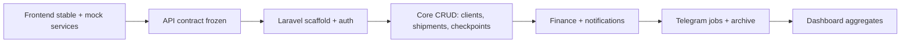

# Implementation plan — Logistics UI

This plan follows the [AUDIT-001](.) frontend audit and project rules in `AGENTS.md`. It defines how to complete the React/Vite UI in place, then add Laravel under `backend/` without redesigning the stakeholder prototype.

---

## 1. Current frontend state

| Area | State |
|------|--------|
| Stack | React 19, TypeScript, Vite 8, CSS (+ Tailwind plugin; UI mostly **inline styles**) |
| Navigation | In-memory `useState` in `App.tsx` — **no URL routing**, no deep links |
| Data | `src/data/mock.ts` for core entities; several pages use **local fixtures** (`Users`, `Archive`, `Telegram`, Dashboard charts) |
| Shell | `Sidebar`, `Header`, `NotificationsPanel` — functional layout, Russian copy |
| Dependencies | `recharts`, `lucide-react` used in app but listed under `devDependencies`; `react-simple-maps` installed but **unused** |
| Dead code | `Managers.tsx` (not in nav), `App.css` (not imported), `monthlyStats` / `transportShare` (unused exports) |

**Maturity:** High-fidelity prototype with interactive filters, modals, and client-side checkpoint edits on Tracking. Most write actions do not persist beyond session refresh.

---

## 2. What is already implemented

### Shell and navigation
- Fixed sidebar (8 pages), header with title/subtitle, search UI (visual), notifications drawer
- Page titles and Russian subtitles per section

### Core pages (wired in `App.tsx`)
| Page | Implemented |
|------|-------------|
| **Dashboard** | KPI cards, period tabs, Recharts (bar/line/pie), calendar popover, direction/manager widgets |
| **Shipments** | List + filters (status, transport), detail panel, progress stepper, checkpoint timeline |
| **Tracking** | Search, shipment cards, SVG world map + route, checkpoint timeline, add-checkpoint modal (session state) |
| **Finance** | KPIs, invoice table + expand rows, client debt chart, status filters |
| **Users** | Role-based user CRUD in local state, access matrix, modals |
| **Archive** | Projects/partners tabs, filters, detail modal with charts |
| **Telegram** | Bot config UI, notification toggles, shipment list, event log (mock) |
| **Settings** | Company profile form (static defaults) |

### Shared mock domain (`mock.ts`)
- Types and seed data: `Shipment`, `CheckPoint`, `Client`, `Manager`, `FinanceRecord`
- Enums: transport types, shipment/finance/checkpoint statuses
- Relations via IDs: `clientId`, `managerId`, `financeId`

### Orphan / partial
- `Managers.tsx` — manager cards + shipment table (duplicate of Users/mock managers; **not linked in nav**)

---

## 3. What to improve before backend

Do these in small, task-scoped PRs. Run `npm run build` after each frontend change.

### Phase A — Foundation (priority)
1. **Routing** — Add React Router (or equivalent) with paths matching sidebar; sync active page to URL.
2. **Dependencies** — Move `lucide-react` and `recharts` to `dependencies`; remove unused `react-simple-maps` or use it intentionally.
3. **Data layer (mock)** — Introduce thin `src/services/` or `src/api/mock/` modules that pages call instead of importing arrays directly; single place for CRUD on mocks (prep for swap to HTTP).
4. **Unify duplicates** — One `statusLabels` / `statusColors` map for shipments; shared transport icon component.
5. **Wire or remove** — Either add `Managers` to nav with clear purpose, or delete/merge into Users + mock `Manager` linkage.
6. **Dead code** — Remove unused `App.css`, unused mock exports, or connect Dashboard to `monthlyStats` / `transportShare`.

### Phase B — MVP behavior (mock-backed)
7. **Shipments** — «Новый груз» opens create form; writes to mock service.
8. **Tracking** — Finance block reads `financeRecords` by `financeId`; checkpoint add/update persists in mock service (survives refresh via `localStorage` optional).
9. **Header search** — Filter shipments/clients across app or navigate to Shipments with query.
10. **Finance** — «Отметить оплаченным» updates mock record; stub PDF (download placeholder).
11. **Notifications** — Read/clear toggles update local notification state.
12. **Settings** — Controlled form + save to mock company profile.

### Phase C — Auth shape (still mock)
13. **Route guards** — Hide sidebar items using same rules as `Users` `AccessMap` (hardcoded current user until API).
14. **Align identities** — Document mapping: `PlatformUser` (login) vs `Manager` (ops profile); optional `managerProfileId` on user.

### Phase D — Polish (optional pre-backend)
15. Replace Wikimedia map image with bundled asset or static file in `public/`.
16. Extract repeated modal/table patterns only where 3+ copies exist (avoid large design-system work).

**Exit criteria for “frontend ready”:** `npm run build` passes; core flows work on mock service with refresh persistence; URL routing works; no orphan critical pages; API contract doc matches `mock.ts` types.

---

## 4. What must not change

- **Repository root** is the only UI codebase — do not copy UI to another project or `reference/` tree.
- **Visual direction** — layout, colors, sidebar structure, Russian labels unless stakeholder approves.
- **No greenfield redesign** — no new design system replacing inline styles project-wide.
- **No premature backend** — no `backend/` folder until frontend exit criteria met and task explicitly requests it.
- **No production API URLs** in frontend until integration phase.
- **Stakeholder page set** — keep Dashboard, Shipments, Tracking, Finance, Users, Archive, Telegram, Settings as the product surface.

---

## 5. Backend integration strategy

### Principles
- Laravel API in `backend/` (JSON REST; Sanctum or Passport for SPA auth TBD).
- **Incremental replacement:** one resource at a time; UI keeps working on mock fallback until endpoint is ready.
- **Contract-first:** OpenAPI or `docs/API.md` derived from models below; frontend `services/*` switches `MockAdapter` → `HttpAdapter` per resource.

### Phases



1. **Contract** — Document request/response shapes from UI audit; align with Eloquent models.
2. **Auth** — Login, roles, middleware matching `AccessMap` sections.
3. **Read paths first** — `GET` shipments (list/detail), clients, managers, finance list.
4. **Write paths** — `POST/PATCH` shipments, checkpoints, payments.
5. **Async** — Telegram dispatch via queue; log delivery status.
6. **Aggregates** — Dashboard endpoints last (derived SQL, not duplicated business rules in frontend).

### Frontend swap pattern

```text
src/services/shipmentService.ts
  → getShipments(): uses import.meta.env.VITE_API_URL ? http : mock
```

No custom logging wrappers in frontend. Use browser devtools and Laravel `Log::` only where needed (failed Telegram, payment webhooks).

---

## 6. Recommended data models (from UI)

Types below mirror `src/data/mock.ts` and page usage. Adjust naming to Laravel conventions (`snake_case` DB, API resources).

### Shipment

| Field | Type | Notes |
|-------|------|--------|
| id | UUID/string | Primary key |
| tracking_number | string | e.g. `LGX-2026-0421` |
| transport_type | enum | `auto`, `air`, `sea`, `intermodal` |
| status | enum | `planned`, `in_transit`, `at_checkpoint`, `delivered`, `delayed` |
| client_id | FK | → Client |
| manager_id | FK | → Manager (ops) |
| origin, destination | string | Display cities |
| cargo, weight, volume | string | Display units as UI shows |
| created_at, estimated_delivery | datetime | |
| finance_id | FK nullable | → FinanceRecord |
| telegram_notifications | boolean | Per-shipment flag |
| route_id | FK nullable | → Route (if routes normalized) |

### Client

| Field | Type | Notes |
|-------|------|--------|
| id | UUID/string | |
| company | string | |
| contact | string | |
| email, phone | string | |
| country | string | |

### Manager

Operations manager (logistics), distinct from login user unless merged later.

| Field | Type | Notes |
|-------|------|--------|
| id | UUID/string | |
| user_id | FK nullable | → users when linked to PlatformUser |
| name | string | |
| email, phone | string | |
| telegram_id | string | Handle |
| region | string | |
| avatar | string | Initials or URL |
| active_shipments | int | Computed or cached |

### Route

Optional normalization if multiple shipments share one route template.

| Field | Type | Notes |
|-------|------|--------|
| id | UUID/string | |
| name | string nullable | |
| origin, destination | string | |
| transport_type | enum | |

Checkpoints usually belong to **Shipment** (UI embeds them on shipment). Route entity is optional for MVP.

### Checkpoint

| Field | Type | Notes |
|-------|------|--------|
| id | UUID/string | |
| shipment_id | FK | |
| sequence | int | Order on timeline |
| city | string | |
| country | string | ISO or code |
| address | string | |
| latitude, longitude | decimal nullable | From `cityGeo` lookup table |
| planned_at | datetime | |
| arrived_at | datetime nullable | |
| status | enum | `passed`, `current`, `upcoming` |
| note | text nullable | Delay/docs |

**Rule:** Only one `current` checkpoint per shipment; transitions drive shipment `status`.

### FinanceRecord

| Field | Type | Notes |
|-------|------|--------|
| id | UUID/string | |
| shipment_id | FK | |
| client_id | FK | |
| total_amount, paid_amount | decimal | |
| currency | string | Default `USD` |
| invoice_date, due_date | date | |
| status | enum | `paid`, `partial`, `unpaid`, `overdue` |
| items | JSON or child table | `{ label, amount }[]` |

### TelegramSetting

| Field | Type | Notes |
|-------|------|--------|
| id | int | Singleton or per-tenant |
| bot_token | encrypted string | Never expose to frontend in prod |
| chat_id | string | Group/channel |
| connected | boolean | |
| event_flags | JSON | Keys: `departure`, `checkpoint`, `customs`, `delay`, `delivery`, `payment`, `docs` |

**Related (post-MVP tables):** `telegram_logs` (shipment_id, type, message, status `sent|failed`, sent_at), `notifications` (in-app).

### Supporting models (post-core)

- **User** — auth, role (`admin|head|manager|finance`), `access` JSON, `telegram`, `active`
- **CompanySetting** — Settings page fields
- **ArchivedProject** — Archive page (read-only history)

---

## 7. Minimal backend implementation order

| Order | Deliverable | Unblocks |
|-------|-------------|----------|
| 1 | Laravel install in `backend/`, `.env`, CORS for Vite dev | Local API |
| 2 | `users` + Sanctum login, roles middleware | Users page, guards |
| 3 | `clients`, `managers` CRUD | Dropdowns, filters |
| 4 | `shipments` CRUD + filters | Shipments page |
| 5 | `checkpoints` nested under shipment | Tracking, timeline |
| 6 | `finance_records` + payment PATCH | Finance page |
| 7 | `notifications` read/update | Header panel |
| 8 | `telegram_settings` + queued `SendTelegramNotification` job | Telegram page |
| 9 | `archived_projects` read-only | Archive page |
| 10 | Dashboard aggregate endpoints | Dashboard charts |

---

## 8. Testing strategy (low token usage)

Keep tests minimal and targeted; avoid large E2E suites early.

### Frontend
| When | Command | Scope |
|------|---------|--------|
| Every frontend task | `npm run build` | Typecheck + bundle |
| Lint regressions | `npm run lint` | Only if touching linted files |
| Manual smoke | Dev server | Click path changed in task description |

Defer Vitest/RTL until mock services exist (unit-test services, not every page). No screenshot tests for MVP.

### Backend (after `backend/` exists)
| When | Command | Scope |
|------|---------|--------|
| Feature task | `php artisan test --filter=ShipmentTest` | One resource at a time |
| Auth | `AuthTest` | Login + forbidden routes |
| Integration | Postman/Insomnia collection in `docs/` | Optional; share as static JSON |

Agents: run **narrow** test filters; do not paste full suite output into chat.

---

## 9. Commit strategy

| Type | Prefix | Example |
|------|--------|---------|
| Docs / plan | `docs:` | `docs: add implementation plan` |
| Frontend feature | `feat:` | `feat: add shipment create form` |
| Frontend fix | `fix:` | `fix: tracking finance from mock` |
| Refactor | `refactor:` | `refactor: extract shipment status maps` |
| Backend | `feat(api):` | `feat(api): shipments index endpoint` |

**Rules:**
- One logical change per commit; small task-based diffs.
- Frontend commits only after `npm run build` passes.
- Backend commits only after relevant `php artisan test` passes.
- Never commit `node_modules/`, `dist/`, `.env`, vendor.
- Commit when user or task explicitly requests it.

---

## 10. Non-goals for MVP

- Microservices, event sourcing, or custom logging frameworks
- Real-time WebSockets (polling or manual refresh acceptable)
- Multi-tenant / white-label
- Full document management (only Telegram “docs” flag + placeholder)
- Mobile-native apps
- Replacing inline styles with a new component library
- Internationalization beyond Russian
- Automated Telegram bot provisioning
- BI/export beyond basic PDF placeholder on invoices
- `Managers` as separate product area unless stakeholder revives it (prefer Users + Manager profile link)

---

## Suggested frontend task sequence (reference)

| ID | Task | Depends |
|----|------|---------|
| F-01 | React Router + URL sync | — |
| F-02 | Mock service layer + move `mock.ts` behind it | — |
| F-03 | Shared status/transport constants | F-02 |
| F-04 | Shipments create + mock persist | F-02 |
| F-05 | Tracking persist + finance link | F-02 |
| F-06 | Finance payment mock + PDF stub | F-02 |
| F-07 | Header search + notifications state | F-02 |
| F-08 | Settings save mock | F-02 |
| F-09 | Route guards from mock current user | F-02 |
| F-10 | Cleanup dead code + deps fix | F-01–F-03 |
| **Gate** | Stakeholder sign-off → backend epic | F-01–F-10 |

---

## Document history

| Date | Change |
|------|--------|
| 2026-05-20 | Initial plan from AUDIT-001 |
