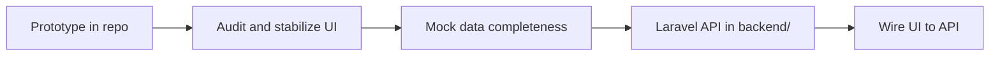

# Project context — Logistics UI

## Overview

Standalone **client-provided logistics UI** built with React, TypeScript, Vite, and CSS. This repository root is the **only** active frontend codebase for the product. The stakeholder prototype is the **source of truth** for layout, navigation, and visual direction.

## Current stack

| Layer | Technology | Location |
|-------|------------|----------|
| UI | React 19 + TypeScript | `src/` |
| Build | Vite 8 | `vite.config.ts` |
| Styling | CSS (+ Tailwind via Vite plugin) | `src/**/*.css` |
| Icons / charts | lucide-react, recharts, react-simple-maps | dependencies |
| Data | Mock fixtures | `src/data/mock.ts` |

## Application surface (prototype)

Pages and shell components reflect the stakeholder design:

- **Pages**: Dashboard, Shipments, Tracking, Finance, Users, Managers, Archive, Settings, Telegram
- **Shell**: `App.tsx`, `Sidebar`, `Header`, `NotificationsPanel`

Extend these files in place; do not fork the UI into another repo or folder.

## Planned backend (not started)

| Item | Plan |
|------|------|
| Framework | Laravel API |
| Location | `backend/` (to be created later) |
| Integration | After frontend audit and stabilization |
| Until then | All reads/writes use mock data |

Agents must **not** scaffold `backend/` or API clients unless the task explicitly requests backend work.

## Phased delivery

1. **Now**: Improve and complete UI in this repo using mocks.
2. **Next**: Stabilize routes, components, and build; preserve visuals.
3. **Later**: Add Laravel under `backend/` and replace mocks incrementally.

## Repository boundaries

**In scope**

- `src/` — application code
- `public/` — static assets
- Config at repo root (`package.json`, `vite.config.ts`, `tsconfig*.json`)

**Out of scope for agents unless requested**

- Copying UI to another monorepo or `reference/` tree
- Greenfield redesign
- Premature backend or database setup

## Environment

- Node.js project; use `npm install` and `npm run dev` / `npm run build`
- Ignore and never commit: `node_modules/`, `dist/`, `.env` (see `.gitignore`)
